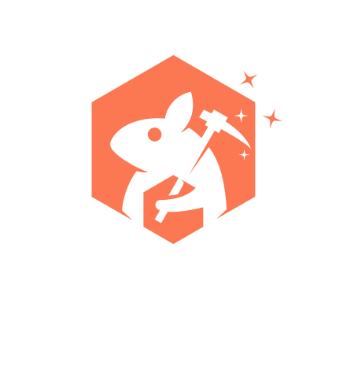

 

  

## Overview

Splinter is an open-source ingestion pipeline designed to transform unstructured data into vectorized formats for integration with knowledge bases. By automating document ingestion and vector embedding, Splinter enables teams to easily convert raw, unstructured content into a format optimized for AI and machine learning applications.

The pipeline accepts a user-provided source container, where documents are uploaded. Once a document is added, Splinter processes the content by extracting meaningful features and converting them into vector embeddings using advanced machine learning models. These embeddings are then stored in a user-provided database, making them ready for integration with downstream AI systems.

To learn more about Splinter, visit our [website](https://splinter-app.github.io/) and [case study](https://splinter-app.github.io/case-study/).

To get started deploying Splinter, visit our [instructions here.](https://github.com/splinter-app/splinter-infrastructure)

## The Team

**<a href="https://github.com/amirsadeghifar" target="_blank">Amir Sadeghifar</a>** _Software Engineer_ • Miami, FL

**<a href="https://github.com/bouyang" target="_blank">Brian Ouyang</a>** _Software Engineer_ • Los Angeles, CA

**<a href="https://github.com/camachoh1" target="_blank">Harold Camacho</a>** _Software Engineer_ • Toronto, Canada

**<a href="https://github.com/rgd731" target="_blank">Ricardo Delgado</a>** _Software Engineer_ • Houston, TX
